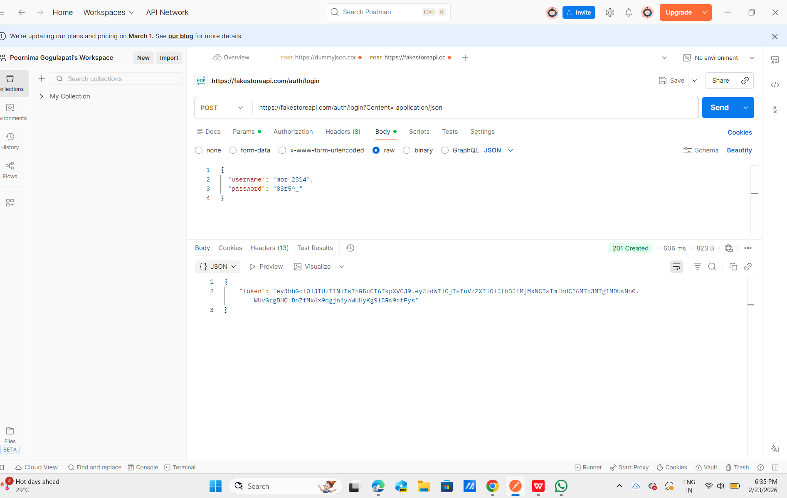
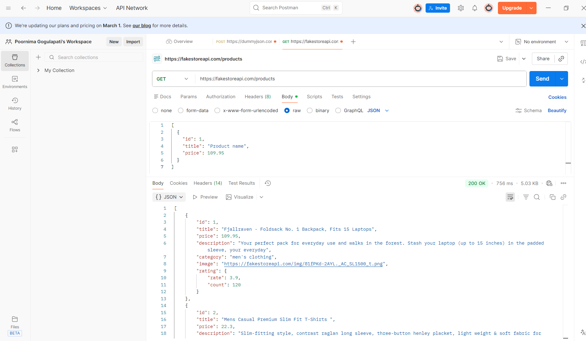

CODTECH Internship Task-2  
API Testing with Postman  

Company: CODTECH IT SOLUTIONS  
Intern Name: GOGULAPATI LAKSHMI POORNIMA  
Intern ID:CTIS5653

Domain: Software Testing  
Duration: 4 Weeks  
Mentor: Neela Santosh

---

Objective  

The objective of this project is to perform functional testing of RESTful APIs using Postman. Specifically, the project focuses on:

Testing Authentication APIs to ensure successful login and token generation  
Testing Data Retrieval APIs to verify that data can be correctly fetched  
Documenting expected and actual results  

---

Description  

This project tests RESTful APIs using Postman to verify authentication and data retrieval functionalities. The APIs are tested for correct request handling, valid responses, and successful data exchange.

---

APIs Tested  

POST Login API (Authentication)  
GET Products API (Data Retrieval)  

---

Tools Used  

Postman  

---

Files in Repository  

CodTech_Task2_API_Testing.postman_collection.json  
Task2_Test_Results.txt  
get.png  
post.png  
README.md  

---

Conclusion  

In this project, RESTful APIs were successfully tested using Postman.  
The Login API returned a success response, and the GET API confirmed data retrieval.  
All test cases executed as expected and documented in the test report.  

---

Proof of Execution  

POST Request Screenshot  

GET Request Screenshot  

